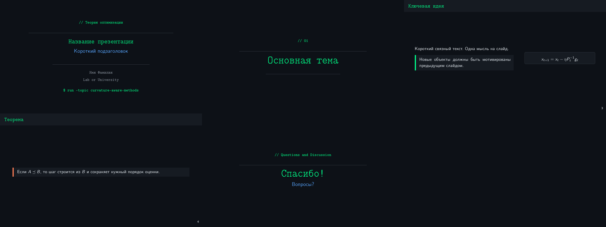

# claude-brainlab

A research-oriented configuration for [Claude Code](https://docs.claude.com/en/docs/claude-code) — built for an ML/AI researcher's day: ingesting papers into Zotero + Obsidian, drafting and reviewing papers, running experiments, and keeping a tightly-linked project knowledge base.

Built on top of [Galaxy-Dawn/claude-scholar](https://github.com/Galaxy-Dawn/claude-scholar) (MIT). Adds a tighter literature pipeline (`paper-ingest`, `paper-search`, `want-2-read`), a deeper Obsidian integration (project hub cards, daily notes, experiment logs, hard-link de-duplication), and per-project SSH/GPU routing.

## What's in the box

| | What it does | Where |
|---|---|---|
| **57 skills** | research, literature, Obsidian, code, writing | `skills/` |
| **37 slash commands** | `/paper-ingest`, `/want-2-read`, `/obsidian-init`, `/analyze-results`, `/rebuttal`, … | `commands/` |
| **16 agents** | `code-reviewer`, `bug-analyzer`, `paper-miner`, `obsidian-hub-creator`, … | `agents/` |
| **6 hooks** | security guard, session start/stop, MemPalace auto-save, Obsidian daily sync, skill activation | `hooks/` |
| **Helper scripts** | statusline, conversation export, MemPalace ↔ Obsidian bridge | `scripts/` |
| **Rules** | coding style, citation rules, security, agent orchestration | `rules/` |
| **Templates** | `settings.json.template`, `.env.example`, project-mapping example | repo root |

## Highlights — what's unique to this fork

These are the parts you won't find in upstream `claude-scholar`. Full details in [`docs/FEATURES.md`](docs/FEATURES.md).

- **`paper-ingest`** — end-to-end pipeline: arXiv URL → BibTeX (external API, never LLM-generated) → PDF → Zotero parent item with PDF child attachment → Obsidian note with 7-section AI Explanation written by Haiku → mandatory final audit.
- **`want-2-read`** — process a Markdown reading queue with one fan-out agent per paper, each invoking `paper-ingest`, plus a final review agent for quality control.
- **`paper-search`** — library-aware arXiv shortlists that don't re-suggest already ingested papers.
- **`create-project`** / **`new-paper`** — set up `~/Papers/<slug>/` with `.claude/CLAUDE.md`, Overleaf `latexmkrc`, Obsidian hub card, people cards, and `obsidian-projects.json` registration.
- **Obsidian integration** — hard-link rule for the same paper in multiple folders, project-memory bootstrap, experiment log, daily research log, link-graph repair, synthesis maps.
- **MemPalace integration** — durable conversation memory with auto-save on every turn (off by default for new installs — see [`docs/MEMPALACE.md`](docs/MEMPALACE.md)).
- **`presentation`** — Beamer-first slide skill with a built-in **terminal-style** theme (dark, monospace, bright-green accent). One source of truth for both `presentation` and `post-acceptance`.

## The `presentation` skill

A LaTeX Beamer skill for theory talks, mathematical decks, and conference presentations. It enforces:

- **One mathematical chain** — every new formula must be motivated by the previous slide. No fact-bag decks.
- **Stable notation** across the whole talk; if you reject a notation choice once, the skill keeps the preferred one in later edits.
- **Russian prose by default** for slide bodies (English for code, method names, file paths). Configurable in `skills/presentation/references/user-presentation-preferences.md`.
- **Overflow is an error** — `Overfull \hbox/\vbox` and `Frame text is shrunk` warnings are treated as layout failures. The skill cuts text, splits frames, or rebalances columns instead of shrinking aggressively.

### Terminal style (the dark theme)

When you say `terminal style` or `терминальный стиль`, the skill applies a custom Beamer theme defined in [`skills/presentation/examples/terminal-style-mini.tex`](skills/presentation/examples/terminal-style-mini.tex). The compiled PDF lives at [`docs/assets/terminal-style-mini.pdf`](docs/assets/terminal-style-mini.pdf).



Visual contract (also documented in [`skills/presentation/examples/terminal-style-notes.md`](skills/presentation/examples/terminal-style-notes.md)):

| Element | Value |
|---|---|
| Theme base | `\usetheme{metropolis}` |
| Aspect ratio | 16:9 (`aspectratio=169`) |
| Background | `#0D1117` |
| Card / title bar | `#161B22` |
| Primary accent (titles, frame headers) | `#00FF88` |
| Secondary accent (subtitles) | `#58A6FF` |
| Theorem / proof accent | `#FF7B54` |
| Body text | `#E6EDF3` |
| Muted text | `#8B949E` |
| Title font | monospace bold (`\ttfamily\bfseries`) |
| Frame title font | monospace bold |
| Theorem/idea blocks | `tcolorbox` with thin colored left rule |
| Title slide | `// header` line + thin rules + large title + terminal-like `$ run --topic ...` footer |
| Section dividers | `// 01`, `// 02`, ... + one large title, no other content |
| Final slide | `Спасибо!` + optional `Вопросы?`, same visual language as title |

The `post-acceptance` skill (conference prep workflow) routes `terminal style` requests to the same canonical example, so a request for "make me a NeurIPS talk in terminal style" produces a deck with this exact look.

To customize the theme: edit `skills/presentation/examples/terminal-style-mini.tex` (or fork it into your project), rerun `bash install/setup.sh` if you want it propagated to `~/.claude/`.

## Install

```bash
git clone https://github.com/<you>/claude-brainlab.git
cd claude-brainlab
bash install/bootstrap.sh   # interactive — fills .env
bash install/setup.sh       # backup-aware copy to ~/.claude/
```

Restart Claude Code afterwards. To roll back: `bash install/uninstall.sh`.

See [`docs/INSTALL.md`](docs/INSTALL.md) for prerequisites and step-by-step explanation.

## Customize

Most paths and identifiers are driven by `.env`. To change a hook, skill, or rule, edit it in this repo and re-run `bash install/setup.sh` — your existing `~/.claude` is backed up first.

For per-skill customization (Zotero parent keys, vault folder taxonomy, MemPalace wing names): see [`docs/CUSTOMIZE.md`](docs/CUSTOMIZE.md).

## Prerequisites

| | Required | Optional |
|---|---|---|
| Claude Code | ✓ | |
| Python 3.10+ | ✓ | |
| Node.js (for hooks) | ✓ | |
| `rsync` | ✓ | |
| Obsidian | | recommended (Obsidian-routed skills no-op without it) |
| Zotero + zotero-mcp | | recommended for `paper-ingest` / `want-2-read` |
| MemPalace | | recommended for cross-session memory |

## Credits

- [Galaxy-Dawn/claude-scholar](https://github.com/Galaxy-Dawn/claude-scholar) — foundation: skill catalog, agent set, install pattern.
- [kepano/obsidian-skills](https://github.com/kepano/obsidian-skills) — vendored Obsidian utility skills (`obsidian-markdown`, `obsidian-cli`, `obsidian-bases`, `json-canvas`, `defuddle`). See `skills/obsidian-skills.UPSTREAM-LICENSE.txt`.
- [MemPalace](https://github.com/MemPalace/mempalace) — the local-first memory MCP this config plugs into.

## License

MIT. See [`LICENSE`](LICENSE).
